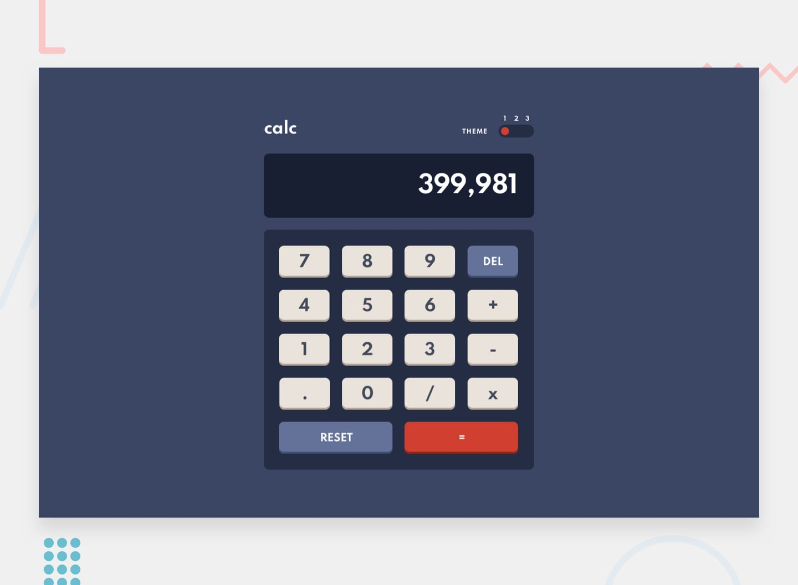

# Frontend Mentor - Calculator app

## Table of contents

- [Overview](#overview)
  - [The challenge](#the-challenge)
- [My process](#my-process)
  - [Built with](#built-with)
  - [Steps](#steps)
  - [What I learned](#what-i-learned)
  - [Continued development](#continued-development)
- [Author](#author)

## Overview 

This is a small proyect I made, inspired by the Calculator app challenge at [Frontend Mentor](https://www.frontendmentor.io) 

## The challenge

The challenge consisted in building a calculator app and get it looking as close to the given design as possible. It must be able to take input by the user and perform the basic mathematic operations.

This app should also have three different color themes available for the user to choose 

Last but not least, this site should be Responsive.

## My process

## Built-with

I chose to write this project as a static page with plain HTML, CSS and Javascript, not using any Frontend library or framework, or any CSS preprocessor. I think exercising your skills with vanilla CSS and JS is not only good for practice, but it is also challenging and fun.  

The site is Responsive, using BEM methodology for the class names, and with a Mobile-First-Design approach.

This project was built between June 14 and June 16 of 2021

## Steps

1. I started by planning the whole design with HTML first. The button grid was not added in this file, as I knew from the start that was going to be taken care of by a Js script. 

2. Right after that, I created four CSS`s files: one for the size and placement of each element, and then one for each theme. Then took all the colors provided by the style-guide file and place them in their respective theme file.

3. I started working on the Header, and thinking how could I code the movement of the theme knob and change the color schemes in the most efficient way.  The themeScript file handles the change, using a variable that can be changed between 1 and 3, and that is included in the string that is placed in the href. This variable also changes the position of the knob.

4. Once that was solved, I coded the layout for the screen and the pad. The buttons of the pad where then added in a grid with Js. I had some problems setting the shadow for the buttons in the grid with a different z-index. If you look at the script, you will notice the buttons are actually children elements of their shadows. That was the only way I found to make the z-index property work how I wanted. 

5. Then I worked on the logic behind the calculator, adding different Event Listeners depending on the button. I use different calculators I had at hand as  guide. 

### What I learned

1. I never worked on different color themes for a page, so I did a little digging. [This video](https://www.youtube.com/watch?v=dOIU773P1iw&t=299s) by Dennis Ivy made me realize I could just change the href property of the link tag, as it is just a string.

2. I never programmed a proper calculator before, so I had to think in a lot of different ways I could make it work. 
Catching all the possible ways in which the calculator logic could break made me think a lot about its functioning. 

3. This is the first time i use CSS variables. I worked with variables in Sass, but never in plain CSS.

4. I found out about the Javascript native function 'eval', which takes a string containing a mathematical operation ans returns its result.

## Continued development

Following this, I will be deploying and sharing other projects I worked on while attending the [Henry Web Development Bootcamp](http://soyhenry.com). All of them using React in the Frontend, and with varying levels of complexity.

## Author
Im Germán Chrystan, a programmer and music composer from Argentina. You can reach me at

- LinkedIn - [Here](https://www.linkedin.com/in/germ%C3%A1n-chrystan/)
- Email - [Here](mailto:germanchrystan@gmail.com)